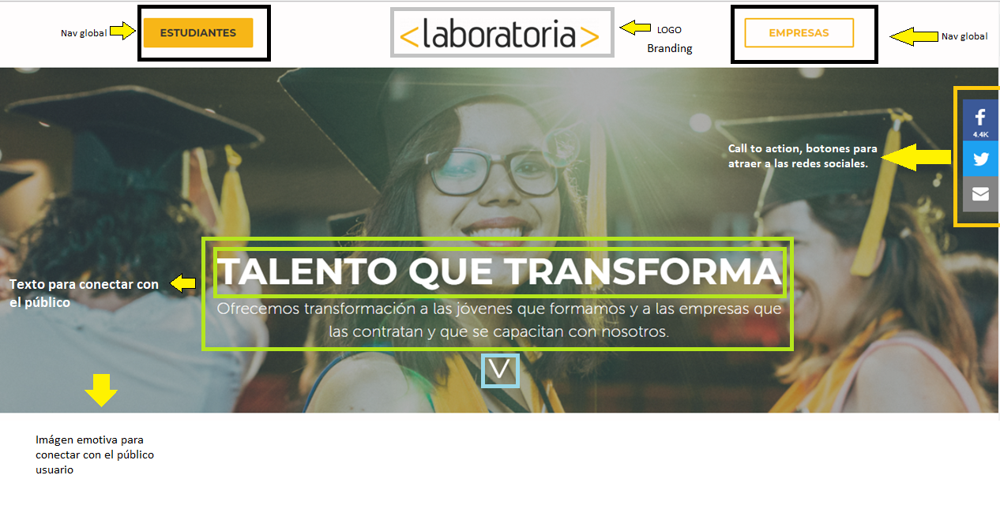

# uxDesign
Reto de código

En la página principal de laboratoria,la primera pantalla (laboratoria.png) encontramos varios elementos de UX, UI, para empezar tenemos la barra de navegación principal, de izq. a derecha esta dividida en tres secciones, la primera de ellas es un botón amarillo con legtras negras, mayúsculas(THINK) que nos permite ingresar a la sección para "ESTUDIANTES", -yo le pondría postulantes-.
 La siguiente sección es la del logo, (expresión del branding o imagen de marca), se encuentra al centro y de tamaño vistoso (con los colores propios de la marca, sobre fondo blanco, UI) para que resalte entre el resto de los elementos.
 La tercera sección en este plano es el botón de "EMPRESAS"(fondo blanco, contorno y letras amarillas) también podrríamos estar hablando de un elemento (CARE).

Bajo esta barra, encontramos una gran imagen (SEE) cuya intensión es la de conectar emocionalmente con el usuario pues es una escena de graduación con 3 personajes femeninos en diferentes planos y posturas, sólo una chica nos mira de frente, justo en el centro de la imagen, ella es el primer plano, le acompaña un destello luminoso en la parte superior izquierda, su sonrisa es enorme, se le ve feliz; es una muy buena imagen para cumplir con el cometido que tiene.

Sobre la imagen tenemos otros elementos como dos textos, un h1 como texto principal que es el slogan de Laboratoria "TALENTO QUE TRANSFORMA"(THINK), este se encuentra al centro, en letras mayúsculas, negritas y el color de texto es blanco. Bajo esta frase inicial tenemos un párrafo de dos líneas que explica brevemente las líneas de negoicio de laboratoria (capacitación de mujeres jóvenes, conexión entre las jóvenes formadas y empresas que las contratan así como capacitación a empresas, THINK ).

Al costado derecho de estos elementos, encontramos los call to action de la sección (DO) que son nada más y nada menos que los iconos (botones) de facebook, twitter y email, ,cuando se pasa el mouse sobre estos, los logos aumentan su anchura y sobre salen del resto, (esto se realiza con la propiedad hover UI) esta barra vertical esta fija en el sitio y si hacemos scroll, la seguiremos encontrando en la misma posición.
En el pie de página, tenemos un ícono o figura como una v, si damos click en esta nos lleva a la siguiente pantalla.

En esta nueva pantalla encontramos un diseño más sencillo que resalta la intensión de postular al programa.(laboratoria2.png)
Primero tenemos una palabra imperativa en letras amarillas y mayúsculas que son también una llamada a la acción del usuario.
Abajo de esta tenemos un texto (THINK) que refuerza el mensaje que llevará al usuario a postular, o en otras palabras, el ofrecimeinto por parte de la marca para que sean participes del programa.
Luego tenemos una pequeña línea amarilla que separa el contenido de la siguiente sección.

Posteriormente tenemos un párrafo de 7 líneas con mayor detalle sobre lo que ofrece Laboratoria.
En el lado derecho encontramos la barra vertical con las redes sociales y correo electrónico que ya aboradmos en la sección anterior.

Para el cierre de esta pantalla, tenemos el botón que es el propósito principal de la misma, el call to action (postulación, DO). En temas de UI podemos decir que el botón esta centrado en la pantalla, es de color amarillo, con letras negras, mayúsculas que lo hacen resaltar del resto de elementos.

La siguiente vista corresponde a (laboratoria3.png) y consta de 3 elementos tan solo. El primero una imagen que ocupa todo lo largo de la pantalla pero no así el alto de la pantalla, en esta se observa una mujer, en primer plano, parece que nos esta diciendo algo, detras de ellas se encuentra una puerta abierta y observamos objetos en un escritorio dentro de una habitación, tambien encontramos 4 sillones individuales, rosados, dispuestos uno al lado del otro.
Sobre la imagen, tenemos un texto "testimonio" de una mujer que ya pasó por Laboratoria y refiere su historia de éxito en 5 líneas, seguidas de su nombre en texto resaltado.
También tenemos la barra verticcal de las redes sociales.

La siguiente pantalla(laboratoria4.png) es muy similar en cuanto diseño y elementos a la segunda pantalla que describí arriba, solo que en este caso el usuario o público al que esta destinada, son las empresas que pueden contratar a egresadas de Laboratoria. Tenemos entonces un par de textos iniciales que plantean las intensiones de la sección, luego encontramos una línea que marca una división visual entre elementos.
Posterior a esta tenemos un párrafo de 9 líneas en el que se explica el programa y los números que manejan en cuánto a inserción laboral(THINK).

Debajo de todo esto, tenemos el botón que nos lleva a otra pestaña (bolsa de trabajo) DO.

En la siguiente pantalla(laboratoria5png) lo que podemos encontrar son 3 elementos para reforzar la vista anterior, tenemos primero una imagen tipo banner horizontal(SEE), de un personaje dando una charla en el evento summit CDMX 2017, esta sirve de fondo para un párrafo con un mensaje testimonial sobre la empleabilidad de egresadas de Laboratoría (THINK).
A un costado tenemos nuestra barra vertical (redes sociales, DO) que ya referimos en múltiples ocasiones.

La siguiente sección o pantalla (laboratoria6.png) es similar a las seciones 2 y 4, sólo que está dirigida a empresas interesadas en capacitación para sus equipos. consta de 4 elementos, primero 2 líneas de texto (SEE) a manera de introducción.
Debajo, encontramos una línea amarilla que divide los contenidos (pequeña).
Bajo esta sigue un párrafo (THINK) que describeen 7 párrafos, la oferta de cursos para las empresas.Y de nuevo al costado, las botones de acción para  redes sociales.

Debajo encontramos una nueva pantalla, con un nuevo banner o imagen (SEE) ancha pero que no ocupa todo el alto, esta vez se aprecian tres personajes, pero solo una mujer esta bien enfocada y se le ve claramente el rostro, esta imagen da una idea muy clara de lo que se trata acá, capacitación. Sobre esta imágen tenemos un texto (THINK) que nuevamente es testimonio para dar confianza, al costado encontramos el elemento fixed acostumbrado (botones de redes).

En la nueva vista o pantalla encontramos varios elementos:
Un texto encabezado de la sección (SEE).
Una línea pequeña y amarilla, centrada que sirve como división del contenido.
Luego encontramos 4 cuadrados amarillos con cifras de desempeño(SEE), el primero refiere el número de egresadas, el segundo muestra el númmero de empresas empleadoras, el tercero indica el porcentaje de colocación de las egresadas y el cuarto representa el nivel de satisfacción de las empresas empleadoras, los cuatros estan alineados uno al lado del otro con pero espaciados entre sí, los números se muestran muy grandes y en negro.
Debajo de estos cuadrados, encontramos otra imagen tipo banner con personajes mundialmente conocidos que incluyen a Mariana Acosta Socia fundadora de Laboratoria (SEE) sobre esta imágen, un texto entrcomillado que refiere  palabras de Barack Obama (THINK).
De costado las redes sociales(DO).

En la siguiente pantalla encontramos muchos elementos (SEE), el primero de ellos, es el encabezado de la sección, seguido por una línea divisoria de contenido, y debajo hay 6 logos de las marcas que apoyan Laboratoria(SEE).

La sección inferior es muy parecida a la anterior, contiene más o menos los mismos elementos y del mismo tipo, como títítulos(RECONOCIMEINTOS, PRESENCIA EN MEDIOS), línea de separación entre elementos, logos y nuestra barra vertical de redes sociales(DO).

Para la última ventana tenemos un encabezado (BLOG, SEE), una línea divisoria entre elementos, debajo, tenemos 3 elementos (THINK) que son 3 entradas al blog de Laboratoria, por debajo, tenemos un texto con un enlace que lleva al BLOG(enlace en amarillo).
Y al pie de página tenemos el footer con el logo(SEE), un texto (THINK) y del lado derecho, un menú vertical con trés opciones (Contáctanos, Trabaja con nosotros y Blog, DO).
